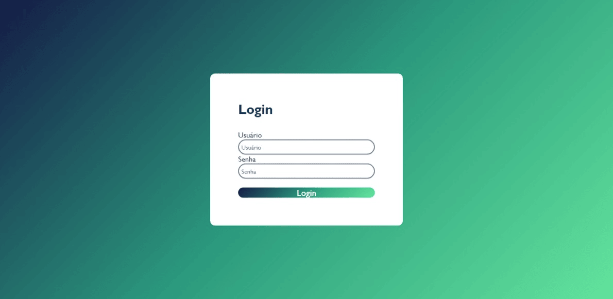

# Tela de login 👩‍💻
## Descrição ✨
Nesse projeto, iremos criar uma tela de login, utilizado como base todas as atividades com ligação a está, que já foram realizadas em FDW!
## Referências 💡✨
Utilizei como referências vídeo (FORMULÁRIO COM HTML E CSS do canal Open Source).
## Tecnologias utilizadas 📡
* HTML5
* CSS
* Git Hub
## Interface ✨

## Link
[Login](file:///C:/Users/emilly.bonfim/OneDrive%20-%20Grupo%20Marista/1%C2%BA%20ANO/FDW/C%C3%B3digos/3%C2%BATRI/login-1/login.html)

